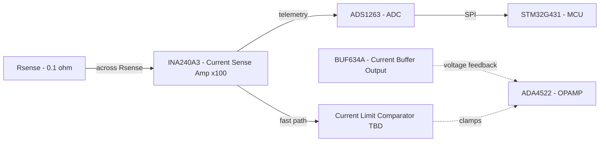

# Feedback Connections

Two independent loops act on the same output stage:

- **Voltage feedback loop**: taps the buffer's output (not the op-amp's),
  so the op-amp corrects for the buffer's own offset automatically.
- **Current sense/limit loop**: INA240 reads across Rsense and splits into
  two paths, a slow telemetry path through the ADC/MCU for dashboard
  display, and a fast analog path through a comparator that clamps the
  op-amp directly if current exceeds the 100 mA threshold, without
  waiting on firmware.

**Open item:** current limit comparator circuit topology not yet designed.