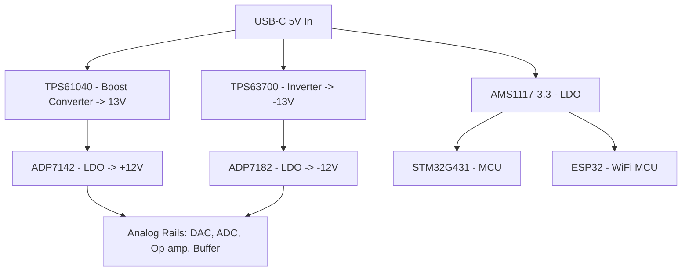

# Power Rail

USB-C 5V input splits into three independent regulation paths: bipolar
analog rails (boost + LDO, inverter + LDO) and a separate digital 3.3V
rail for the MCU/WiFi. Kept separate so digital switching noise never
reaches the precision analog supply.

**Open item:** digital 3.3V regulator part not yet selected.