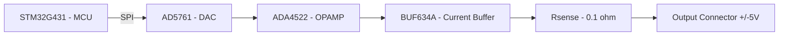

# Output Signal Generation Path

MCU drives the DAC over SPI at 80 kSps (8x oversampling at the 10 kHz
target). The DAC output feeds a precision op-amp, which drives a current
buffer inside its feedback loop to reach the 100 mA current limit target
without sacrificing DC accuracy. Rsense sits between the buffer and the
output connector, in the main current path.

